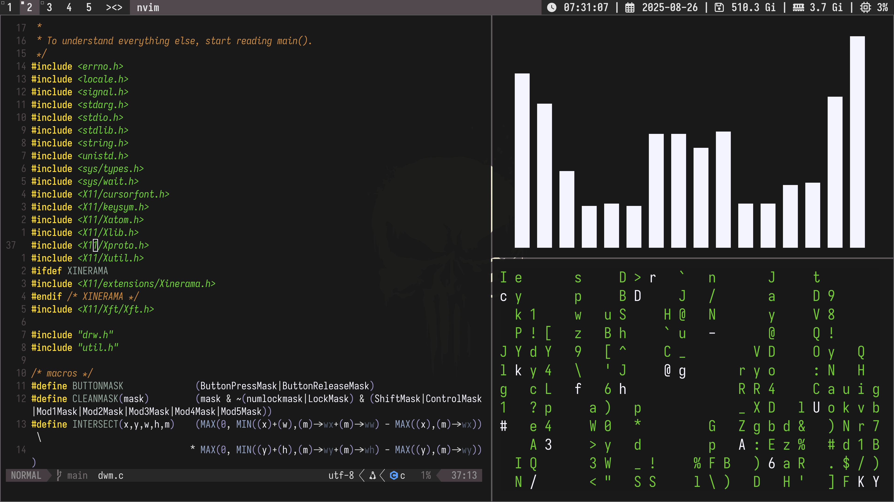

# LINUX DOTFILES





## Components 

| Component                 | Name |
|---|---|
| Linux Distribution        | ARCH |
| Display Server            | X11 |
| Compositor                | PICOM |
| Windows Manager           | DWM |
| Display Locker            | SLOCK |
| Status Bar                | SLSTATUS |
| Launcher                  | ROFI |
| Notifications Daemon      | DUNST |
| Terminal Emulator         | WEZTERM |
| Shell                     | ZSH + OH MY ZSH - LAMBDA |
| Color Theme               | GRUBER-DARCKER |
| Font                      | IOSEVKA NERD FONT |
| Editor                    | NEOVIM |
| System Information Tool   | FASTFETCH + FASTCAT - PENTAGRAM |
| Audio Backend             | PIPEWIRE + PIPEWIRE-PULSE |
| Bluetooth Backend         | BLUEZ |
| RGB Manager               | OPENRGB |
| File Manager              | YAZI |
| Wallpaper Tool            | FEH |

```sh
```
